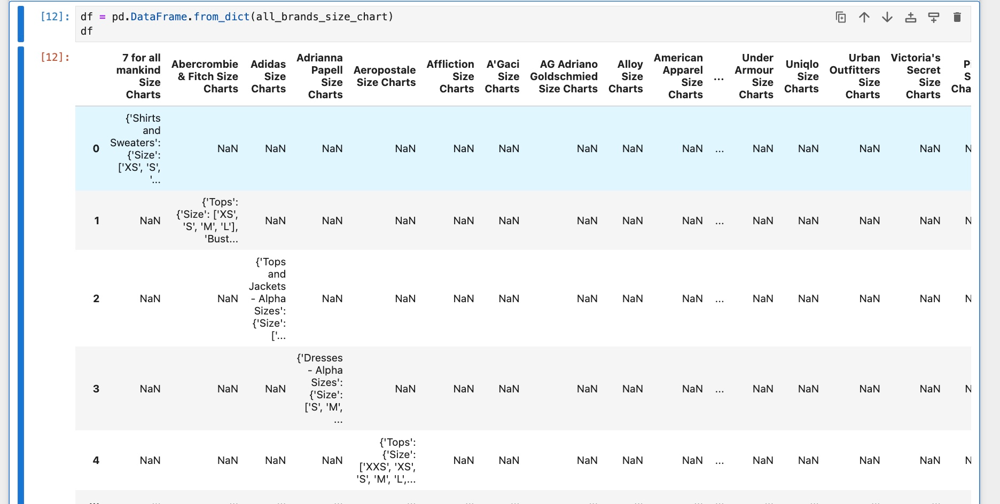

# vanitysizing
My second data project looked into how major U.S and UK brands all have different size charts. 

## Goals
- Show the challenges women face because there is so much size variation in clothing brands.
- Produce a plotly beeswarm or scatterplot graph. That way, users can hoover over the points and see that each dot represents a brand.
- Produce a chart similar to the one I found on [The Pudding](https://pudding.cool/projects/vocabulary/index.html)

 ## Steps I took to accomplish this 
- I scraped sizechart.com to find a list of major U.S and UK brands. I multiscraped the pages and found size charts for each of these brands. I had to double check all the brands to ensure sizechart.com was up to date. It was not. So, I had to go to several clothing store's websites and scrape from there using playwright to speed up the process.
- I charted and annotated via plotly, ggplot2 on RStudio.
- I used Canva to create my moving gif header. I also used Canva to make my first range chart, specifically, to paste the logos as a the y-axis instead of standard text.
- I always envisioned creating a scrolly feature on the bottom, specifically a measuring tape, because it matched my topic's theme.
- I interviewed an expert on vanity sizing and a source who has experienced this first hand.
- I gathered advice from my mentors in-class and out of class to gain insight on what data visuals appeal to an audience. 

## Methodology documentation:
For my first chart, I wanted to look at clothes popular for college women and compare it to top high-end brands known for their jeans. I relied on two lists that helped me 
build my dataset. 

   -https://www.hercampus.com/style/best-favorite-affordable-jeans-college-women/
      a. This link gave me a comprehensive list of popular, affordable brands college women go to buy jeans. 

   -https://www.nytimes.com/wirecutter/reviews/best-womens-jeans/
      a. This link gave a comprehensive list of popular, high-end brands that provide jeans for women. 

   I merged these list and made a dataset that looked what each brand constitutes as a extra small, small, medium, large and extra large. 

## Helpful links: 

-I relied on the following links to learn more about vanity sizing. These readings also helped me narrow down which brands to pay close attention to.

1) https://www.collegefashionista.com/affordable-clothing-stores/
2) https://www.whowhatwear.com/places-to-shop-for-clothes-in-your-20s
3) https://www.rankandstyle.com/articles/places-to-shop-20s-30s-40s
4) https://www.buzzfeed.com/maitlandquitmeyer/the-best-places-to-buy-inexpensive-clothes-online
5) https://www.buzzfeed.com/amandadavis3/best-online-clothing-store

## Challenges, what I learned and data analysis process. 
 1. [SizeChart.com](https://www.sizechart.com/) was not up to date. This meant having to physically go through over 100 websites to double check if the sizes were accurate or not. I also found that depending on whether you are buying jeans or pants, sizes even within the brand will change. 

 2. Scraping HORRORS. You can see in my collectingdata notebook, but when I did my first scrap, every information per brand did not print out in different columns but instead, all in one cell. It was unorganized and messy. Thanks to stack overflow and video tutorials, I learned I could use the .explode function to take out details from a single value and place them in their respective column.

    

 4. Size ranges. Some clothing brands listed out sizes as ranges. For example, a size 2 in jeans could be 30-35 inches for waist. This got tricky especially when I was using pandas. So after speaking to my TA and mentor, I decided to make these values floats and find the average of each range. 
